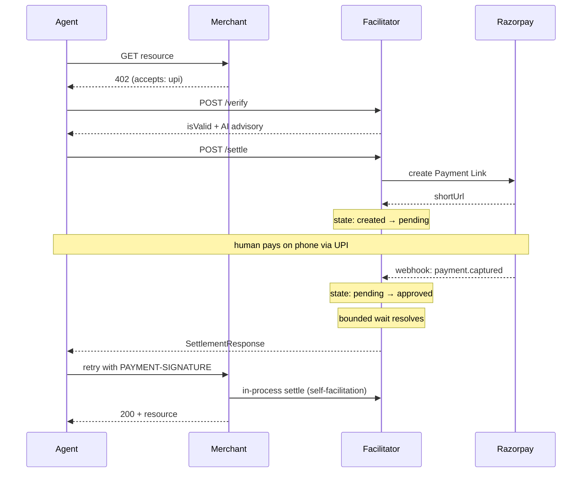

# fiat402

A `upi` payment scheme for the x402 protocol, settling AI agent payments over India's UPI rail via Razorpay.

## The problem

x402 is built for synchronous settlement: a client signs a payment authorization, the facilitator verifies the signature, and settlement is submitted on-chain in roughly one to two seconds. Every scheme shipped with the protocol so far — `exact` on EVM, `exact` on SVM — depends on that shape, because verifying a cryptographic signature is itself proof the payer authorized the transfer.

UPI has no client-side signing step. A UPI collect request is approved by a human, on their own phone, inside their own banking app, and that approval can take anywhere from a few seconds to the full length of `maxTimeoutSeconds`. There is nothing for the agent's client software to sign up front, because the agent isn't the party authorizing the payment — the payer is, out-of-band, after the request has already been sent. fiat402 is a standalone facilitator that bridges this gap: it lets x402 carry a `scheme: "upi"` payment requirement end to end, treating the asynchronous Razorpay webhook — not a signature — as the settlement proof.

## How it works

1. An AI agent hits a protected merchant endpoint and gets back an HTTP 402 with `scheme: "upi"`, `network: "upi:in"` in the `accepts` array.
2. The agent calls the facilitator's `POST /verify` — the deterministic policy engine runs first (hard amount ceiling, merchant allowlist, velocity limit), then, only if that passes, the AI advisory layer returns a recommendation.
3. The agent calls `POST /settle`. The facilitator creates a Razorpay UPI Payment Link and the client receives a `shortUrl`.
4. A human pays by approving the collect request on their phone via UPI.
5. Razorpay fires a `payment.captured` webhook; the facilitator's state machine transitions the request `pending -> approved`.
6. The facilitator's bounded pub/sub wait inside `/settle` resolves, and the merchant returns `200` with the protected resource.



## What makes this a genuine protocol extension

`UpiSchemeClient` implements `SchemeNetworkClient` from `@x402/core` — the same interface `ExactEvmScheme` implements — and `registerUpiScheme(client, options)` registers it via `client.register("upi:in", new UpiSchemeClient(options))`, mirroring `registerExactEvmScheme` from `@x402/evm`. `x402Client` itself is untouched: no fork, no patch, no forked payment-selection logic. `upi` sits in a `PaymentRequirements`' `accepts` array exactly the way `exact` does; a client that registers both schemes lets `x402Client` pick whichever one the server actually accepts. The one deliberate divergence is in `createPaymentPayload`: instead of producing a cryptographic signature, it builds a `UpiPaymentPayload` — `{ payerVpa?: string, txnRef?: string }` — because UPI collect has no client-side key. The payer authorizes the transfer out-of-band, on their own device, and the facilitator learns that happened from Razorpay's `payment.captured` webhook, not from anything returned by this method.

## Architecture

| Component | Stack | Responsibility |
|---|---|---|
| Facilitator | Node.js + Express, Upstash Redis, Postgres | `/verify`, `/settle`, `/supported`, Razorpay webhook receiver, state machine |
| Merchant | Next.js 15 App Router | Protected resource, self-facilitation (in-process verify + settle) |
| Dashboard | Next.js 15, Tailwind, SSE | Live state machine view, decision panel, UPI QR |
| UPI Scheme Client | `@x402/fetch`, `@x402/core` | `UpiSchemeClient`, `registerUpiScheme` |

| Layer | Decision | Overridable? |
|---|---|---|
| Deterministic policy | Hard amount ceiling, merchant allowlist, velocity limit | No — final authority |
| AI advisory (Gemini 2.5 Flash → Groq gpt-oss-120b → fail-closed) | Approve / hold / flag | Yes — advisory only |

## The bounded-wait problem

x402's `/settle` has to return a `SettlementResponse` synchronously — it's a single HTTP request/response cycle. UPI settlement is not synchronous: it depends on a human approving a collect request on their phone, on their own schedule, then on Razorpay delivering a webhook. The facilitator's `awaitResolution` bridges this by subscribing to the `fiat402:events` Redis pub/sub channel and blocking, with a hard ceiling at `maxTimeoutSeconds`, until either a terminal state transition arrives or the timeout fires. This is deliberately not a polling loop: Razorpay can fire `payment.failed` followed later by `payment.captured` for the same Payment Link when a payer declines and then retries inside the UPI app, and a polling loop that already returned a 402 on the first `declined` observation has no way to un-return that response when the retry-driven `approved` event shows up seconds later. Staying subscribed is what lets the still-open bounded wait catch that late approval correctly.

## Repo structure

```
fiat402/
├── apps/
│   ├── facilitator/     # Express facilitator server
│   ├── merchant/        # Next.js protected resource
│   └── dashboard/       # Live control tower
├── packages/
│   └── scheme-upi/      # UPI scheme types + state machine
├── x402-upi-client/     # UpiSchemeClient + demo runner
├── docs/
│   └── scheme_upi.md    # Protocol spec for the upi scheme
└── CLAUDE.md            # Wire format, key schema, pub/sub contract
```

## Running locally

There is no root `package.json` or workspace file — each package installs independently.

1. Copy `.env.example` to `.env` at the repo root and fill in all values.
2. Install dependencies separately in `packages/scheme-upi`, `apps/facilitator`, `apps/merchant`, `apps/dashboard`, and `x402-upi-client` (`pnpm install` in each directory).
3. Run the Postgres migration: `psql $DATABASE_URL -f apps/facilitator/migrations/0001_create_reconciliation_records.sql`
4. Start the facilitator: `cd apps/facilitator && npx tsx src/server.ts`
5. Start the merchant: `cd apps/merchant && pnpm dev`
6. Start the dashboard: `cd apps/dashboard && pnpm dev`
7. Run the demo: `cd x402-upi-client && npx tsx test/demo.ts`

The demo script requires the facilitator and merchant to be running and the merchant to be returning 402 before it proceeds.

## Environment variables

See `.env.example` for the full list. It's organized into sections: Razorpay (API keys and webhook secret), Upstash Redis (state machine + pub/sub store), Postgres (reconciliation record storage), AI Advisory (Gemini/Groq keys for the advisory layer), Merchant (the demo merchant's VPA, name, and resource price), Policy (amount ceiling, merchant allowlist, velocity limit, and the confirm-gate secret), x402 UPI Client / demo (the merchant URL and demo payer VPA the demo script targets), and Facilitator server (listen port and allowed CORS origins).

## Deployment

The facilitator and merchant both deploy to Render as long-running Node
services (not Vercel) -- the merchant's `/api/premium-data` route blocks on
the facilitator's bounded UPI settlement wait (`maxTimeoutSeconds`, up to
90s), which doesn't fit a serverless function's execution ceiling. Render has
no such ceiling, and both services read `PORT` from the environment, which
Render auto-injects (facilitator: `apps/facilitator/src/server.ts`; merchant:
Next.js's own `next start`, via `apps/merchant/package.json`'s `start`
script). The dashboard remains on Vercel -- it's a polling client with no
long-lived connections or bounded waits of its own.

## Test suite

59 tests across 8 files, all passing.

| Package | Tests |
|---|---|
| apps/facilitator | 38 |
| packages/scheme-upi | 15 |
| apps/merchant | 6 |

Run with `pnpm test` inside each package (`apps/facilitator`, `packages/scheme-upi`, `apps/merchant`) — there is no unified root test command.

## Track

Razorpay AI Buildathon 2026 — Track 01: AI Growth & Agentic Commerce.

fiat402 lets AI agents autonomously pay for resources over India's dominant payment rail without requiring a crypto wallet, a pre-existing merchant account, or human approval at the agent level.
